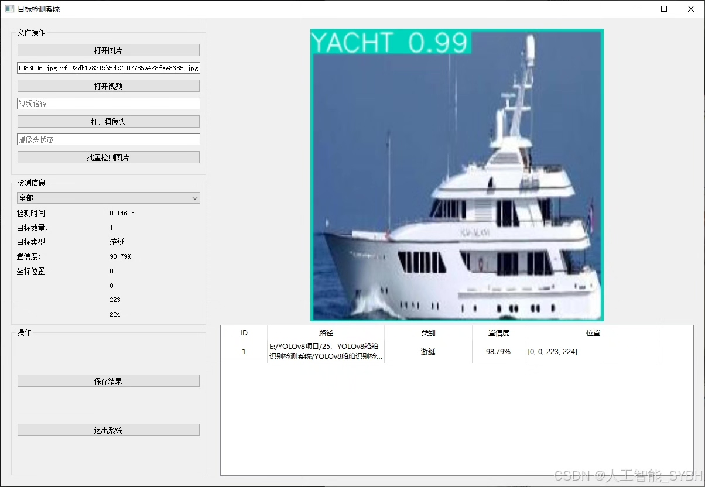
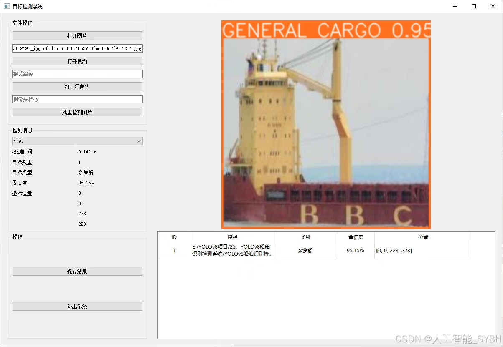
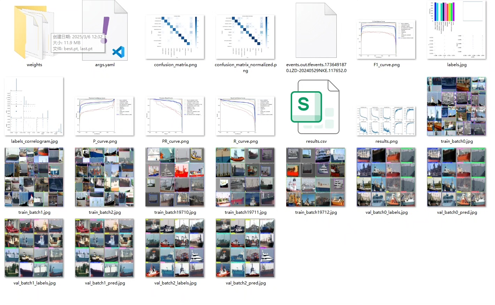
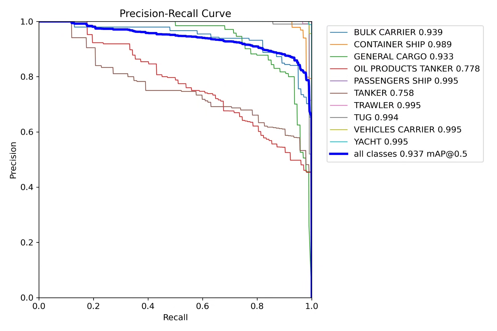
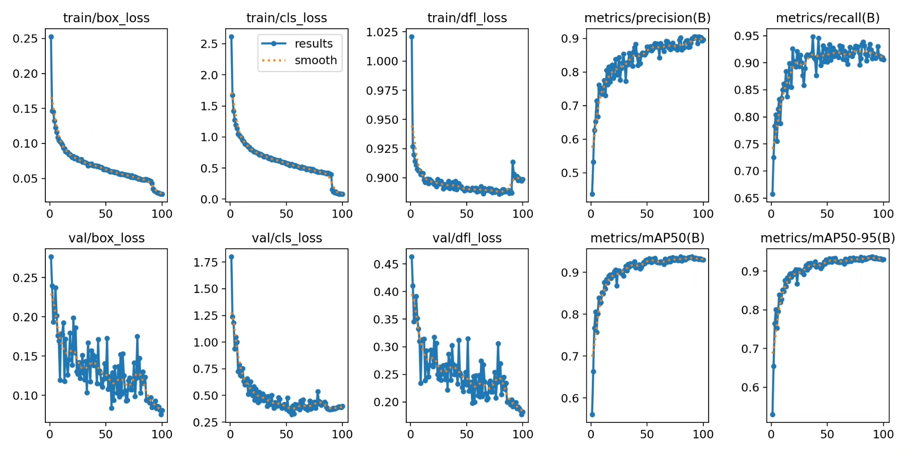
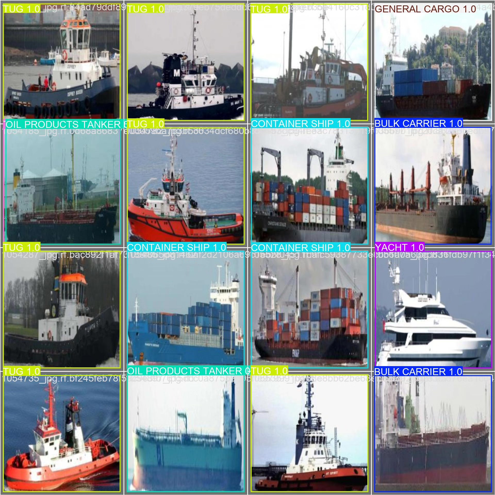
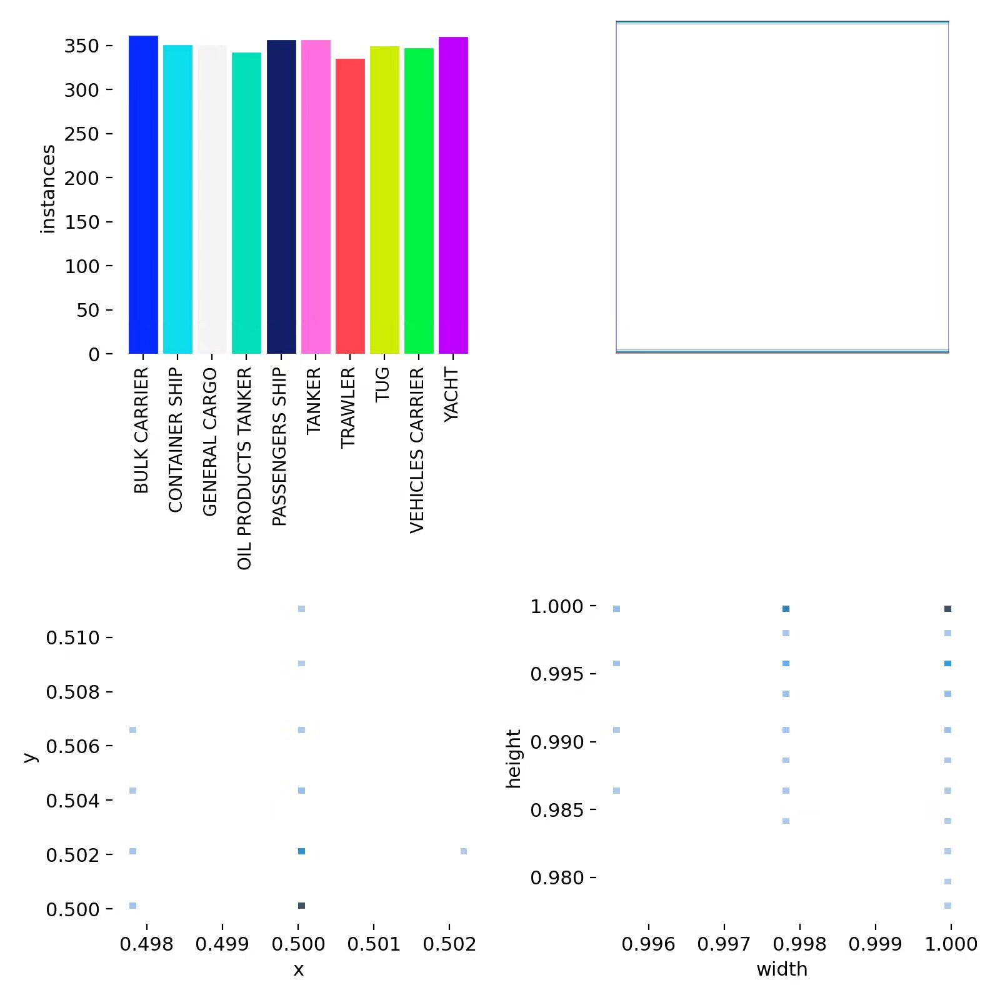
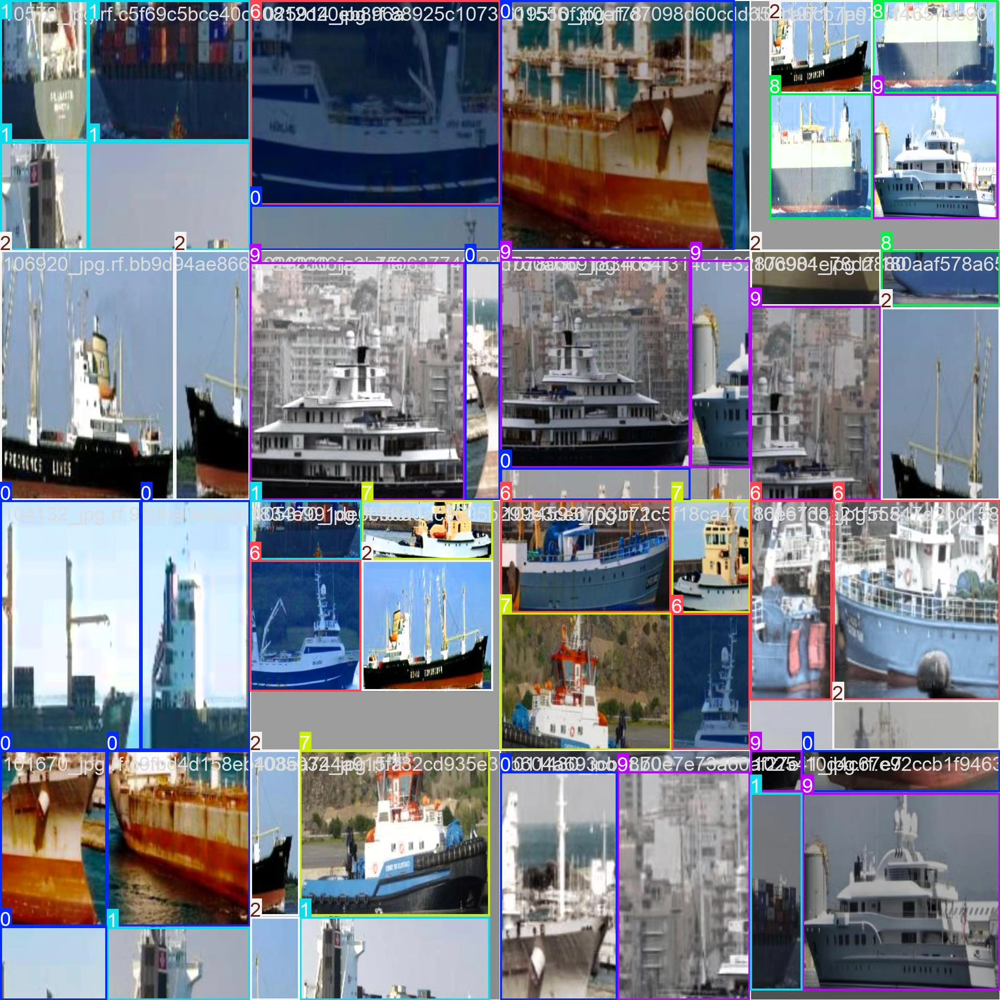

# Based on YOLOv8 deep learning for ship recognition detection system (YOLOv8+Y)

## Body

Based on the advanced YOLOv8 object detection algorithm, this project has developed a high-performance intelligent ship recognition and classification system. The system can accurately recognize and classify 10 common types of ships, including bulk carriers (BULK CARRIER), container ships (CONTAINER SHIP), general cargo ships (GENERAL CARGO), oil tankers (OIL PRODUCTS TANKER), passenger ships (PASSENGERS SHIP), tankers (TANKER), trawlers (TRAWLER), tugs (TUG), vehicles transport ships (VEHICLES CARRIER) and yachts (YACHT). The project uses a large-scale professional dataset for training, containing 3498 training images, 1000 validation images and 500 test images, to ensure that the model has excellent generalization ability and robustness.

The company's products have obtained YOLO official commercial license certification.

We provide after-sales service.

After payment, we will provide WeChat IDs, answering questions anytime.

Environment configuration: We will provide an environment configuration tutorial, and WeChat provides Q&A.

Remote installation service: If you need remote configuration, additional payment of 69 is required,
Configuration failure, all fees are refunded (specially for old computers only refund installation fee)

Retraining dataset: After configuring the environment, you can train on your own computer.
If you need us to retrain, just pay 69+ computing power fee (2.5 yuan/hour)

Full after-sales service

## Images

## Payment

Here is a pay link on Stripe ( https://buy.stripe.com/3cs8yP7sY87d0vu9AB ). Please contact me lonlonago@foxmail.com after funding $89, and I will send you a complete data files , thank you!

